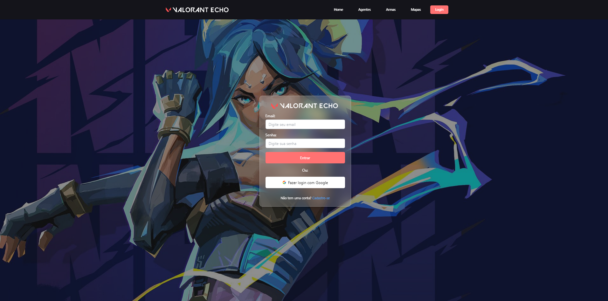
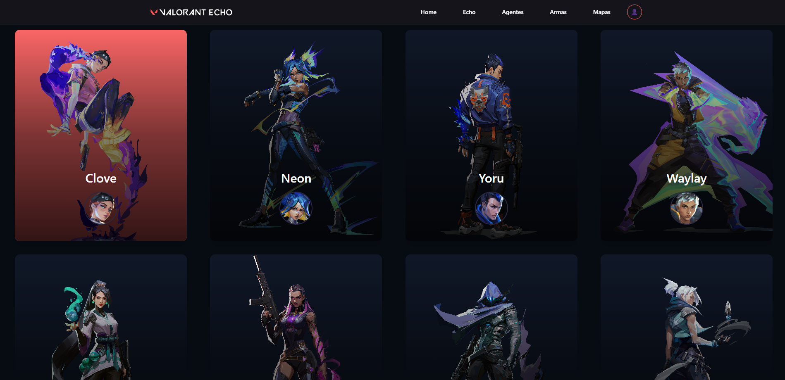
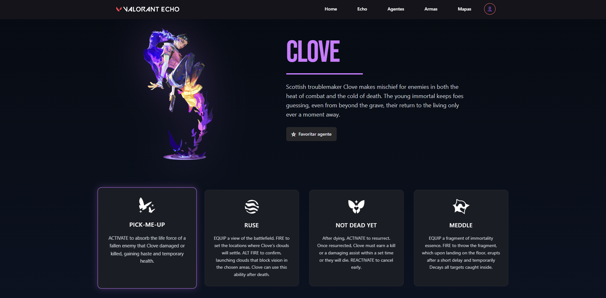

  

<h1 align="center">Valorant Echo</h1>

  Plataforma web focada em jogadores de Valorant, unindo informações do jogo com perfis personalizados.

---

## 🎮 Sobre

**Valorant Echo** é uma aplicação web desenvolvida para centralizar informações essenciais do universo de Valorant, como **agentes, mapas e armas**, ao mesmo tempo em que oferece uma experiência personalizada para cada jogador.

Além do conteúdo informativo, o projeto conta com **autenticação de usuários** e um **sistema de perfil**, onde cada jogador pode definir seu nick no jogo, rank atual e agentes favoritos, criando uma identidade própria dentro da plataforma.

---

## ✔ Features atuais

- Visualização de dados do jogo  
  - Agentes  
  - Mapas  
  - Armas  

- Autenticação de usuários  
- Perfil personalizado  
  - Nick no jogo  
  - Rank  
  - Agentes favoritos  

---

## 🚀 Features em desenvolvimento

-  Busca e visualização de perfis de outros jogadores  
-  Recursos sociais para interação entre usuários  
-  Sistema de Treino personalizado para evolução do jogador

---

## 💻 Stacks

### Frontend
- React
- TypeScript
- Tailwind CSS
- Framer Motion

### Backend
- Node.js
- Express
- PostgreSQL
- Prisma ORM
- Autenticação com JWT
- ([Repositório Backend](https://github.com/kauamassei/project-echo-svr))

---

## 📷 Preview

  

  

  

  

---

## 📄 Status 

🟡 Em desenvolvimento — novas funcionalidades serão adicionadas em breve.

---

## Desenvolvido por

 **Kauã Massei**  

